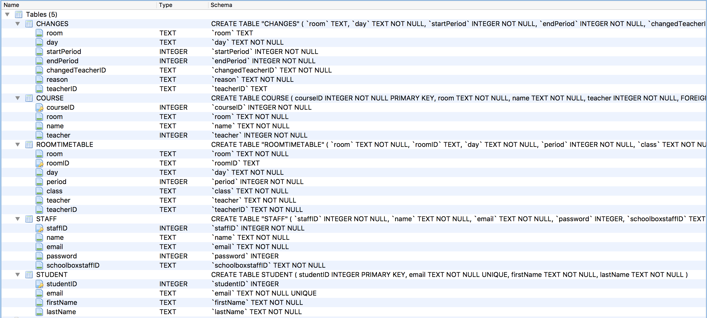
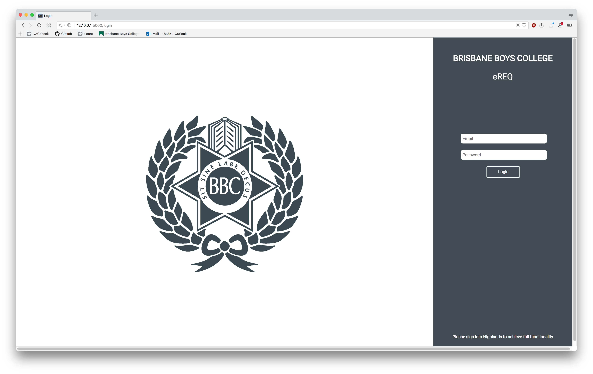
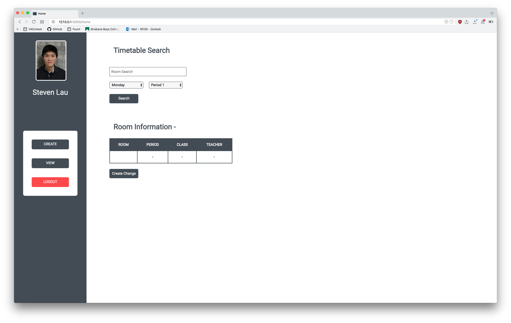
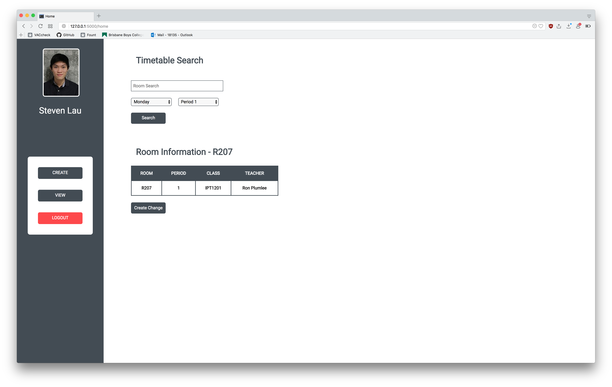
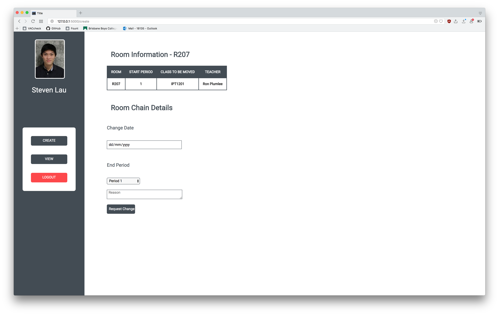
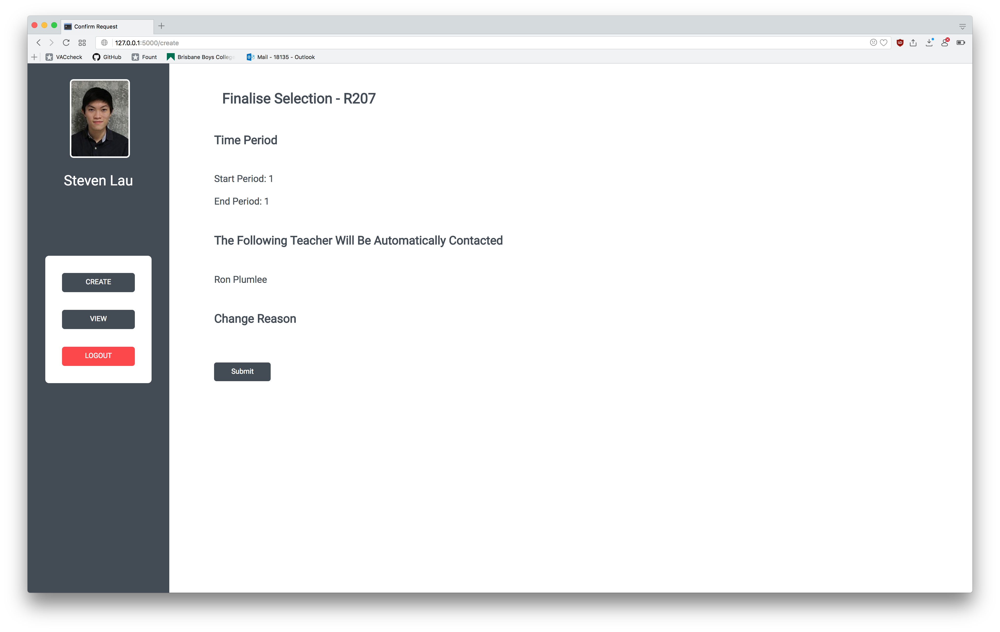
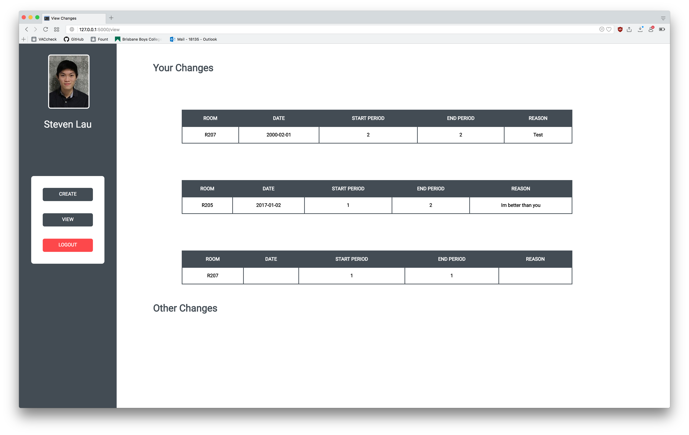

<h1> </h1>

<h1> </h1>

# IPT B4 Assignment

### Thomas Fraser | 12 Hamilton

### Stages 4-6

<P hidden>Page Break to end the page 👍</P>

<P style="page-break-before: always"></P>

## Stage 4 - Implementation

The Web Application was designed using web technologies such as Python, Flask, Sqlite3, HTML, CSS and a tid-bit of Javascript. All of these technologies came together to form the bases of a Web Application designed to help staff member request and organise room changes. Database and HTML web page construction was one of the most time consuming and difficult stages of the Web App design and construction. Many changes were made from the database provided in the CSD and ONF diagrams as it was found that the layout of the database would not be able to achieve the desired usability. Changes to the database layout include the introduction of tables labeled; 'ROOMTIMETABLE' and 'CHANGES'. These two tables contain the timetable for each room and the changes requested across the system respectively. These tables replaced most of the need for the 'COURSES' table however it is still used for some course naming around the app and therefore cannot be removed from the database. Due to a lack of time to complete the web application, the component that notified students of database changes had to be removed from the project. The aforementioned changes to the database led to the lack of time causing certain parts of the project design to be not completed. With that being said, the student notification part of the project could be implemented somewhat easily if extra time was allowed. Changes were made to the staff table to contain a 'schoolboxstaffId' column that contains the staff members SchoolBox UID. This is used to automatically collect and display the staff members picture by using the SchoolBox database that already exists. However, for this feature to work, the user of the Web App must be signed into SchoolBox as well. Queries to the database mostly consist of 'SELECT' queries with the occasional 'INSERT' query used to place room change information into the database.

###### Example Queries

The login query to check user login information

```python
email = request.form["email"]
password = request.form["password"]
emailQuery = database.execute("SELECT email FROM staff WHERE email = ? ", (email,))
emailQuery = emailQuery.fetchone()
passwordQuery = database.execute("SELECT password FROM staff WHERE password = ? AND email = ?", (password,email))
passwordQuery = passwordQuery.fetchone()
```

The query that collects information about a room pertaining to a certain period and day of the week

```python
day = request.form["date"]
session['day'] = day
period = request.form["period"]
room = request.form["room"]
query = database.execute("SELECT room,period,teacherID,class FROM ROOMTIMETABLE where day = ? AND room = ? AND period = ?", (day,room,period)).fetchone()
```


The query that collects information about a change before displaying it to a user in the 'view' tab

```python
databaseCollection = database.execute("SELECT room, day, startPeriod, endPeriod, reason FROM CHANGES WHERE changedTeacherID = ?", (findStaffInfo()['name'],)).fetchall()
```


The query that adds the room change into the 'CHANGES' table

```python
databaseInput = [session['roomChoice']['room'],date,session['roomChoice']['period'], endPeriod, findStaffInfo()['name'], reason, session['roomChoice']['teacher']]
database.execute("INSERT INTO CHANGES VALUES (?, ?, ?, ?, ?, ?, ?)", (databaseInput),)
c.commit()
```

 ###### Final Database Design

 ###### 

## Stage 5 - Testing

####Test Design

###### Test 1 - Multiple Changes on a room

The first test was designed to test the databases ability at handling multiple room changes set upon the same room for the same time. This test will test the Web Apps ability to test for previous information within the database using Sqlite3 Queries and flask requests.

**Test 1 - Expected Results**

The expected result for test 1 is that the flask application will detect that the second request is clashing with the first and will notify the user by throwing an error that will show as a popup. The user is then given a option to hide the error. The application must not write the change to the database.

**Test 1 - Found Results**

After the test occurred the following results were found; The application and database were unable to handle the input of a second change occurring on the same date in the same room. The application didn't throw and error but instead added the second change to the changes database. This led to two members and classes being scheduled for the same class room.


The database and application could easily be updated to preform a query to the database before adding a change to the database that queries if a room change has already been set in place for the room in question. An example of the code that could be used to improve can be found below.

```python
room = "roomToCheck"
startPeriod = "startPeriodToCheck"
endPeriod = "endPeriodToCheck"
date = "dateToCheck"
#Query to check database
isChangeAlready = database.execute("SELECT * FROM CHANGE WHERE room = ? AND startPeriod BETWEEN ? AND ? AND date = ?", (room, startPeriod, endPeriod, date),)
if !(isChangeAlready):
  #No Room Change
else:
  #Room Change
```

 ###### Test 2 - Incorrect credentials, Username and Password

The second test was designed to test the security and rigidity of the login page. The login page is redirected to from both the root ('/') and ('/login') directories. The login page consists of a Brisbane Boys' College logo, a username, password and submit button. It should be known that in a real implementation of this system into the school, the username and password processing would be handled by the current school system, with the eREQ system simply passing off the username and password to the school system for validation. In this example project however, a simple alternative was developed where the email and password for each user was stored in the STAFF database with the rest of their information. This test's purpose is to test the application and databases ability to receive the email and password of the user and confirm their identity. 

**Test 2 - Expected Results**

The expected result for test 2 is for the application and database to recognise when the incorrect username or password has been entered and redirect the user to the login page. When the correct credentials are entered, the application should redirect the user to the ('/home') directory.

**Test 2 - Found Results**

The results for the second test upon the application and database were found to be as expected. The database and application was capable of determining correct credentials from incorrect ones and redirected the user accordingly.


An improvement to this test would be to give the user a popup box or similar notification to tell them of the incorrect username or password instead of simply redirecting the user back to ('/login') on the action of entering an incorrect username or password which can be quite jarring and sudden. This could be implemented with code similar to as shown below.

```python
incorrectUSPW = "The incorrect Username or Password was entered."
if emailQuery:
    if passwordQuery:
        session["userEmail"] = email
        return redirect("/home")
    else:
        return redirect("/login", error=incorrectUSPW)
else:
    return redirect("/login", error=incorrectUSPW)
```

###### Test 3 - Home page incorrect room input

The third test is designed to test if the user has correctly entered a classroom that exists within the database. When the user enters the room name into the input box of the Home Form it must be correctly identified as a valid room of the college.

**Test 3 - Expected Results**

The results expected for test 3 are that the application and database will be able to recognise a correctly typed room name from a mistyped room name. It is expected that the web application will query the database for information on the room name and return whether the room exists or not.

**Test 3 - Found Results**

The results for the third test on the application and database count that the application was correctly able to determine a mistyped room name from a correctly entered one. It did this by querying the database to see if the entered room change existed in any of the database rows. If the room name wasn't found, the web app threw an error which was received by the user in a popup on the website. When the correct room name was entered the information was allowed to pass and the user move onward in the process of compiling the room change.

###### Test 4 - Sending emails to the staff member

The fourth test is designed to test the web application and database's ability to send an email to the teachers effected by a room change. The notification should be received by the teacher and should contain critical information to the change such as the date, periods, room, reason and teacher that requested the change.


**Test 4 - Expected Results**

The database and application should develop and send an email to the specified staff member that contains important information relating to the room change. The email should specify that the user check eREQ for further details about the room change.

**Test 4 - Found Results**

The found results of this test found that the database successfully sent the email to the staff member about the room change. The email contained all the correct information about the change that was queried from the database. The only blemish is that the name of the staff member that requested the room change was flanked by parentheses and quotations.

*Email From Web App*

```
Dr Andrew Stewart,

A room change request has been filed by ('Steven Lau'), for room R207 during the periods of 1-2 on 02-09-2017. The reason for this change is 'test'.
For futher information please visit eREQ.

Regards,
eREQ System Administrator
```


==Note==

This functionality has been removed to prevent the user from accidentally emailing teachers during testing.

## Stage 6 - Evaluation

####Evaluation of the form design

In stage 1-3, several form design and layouts were given as examples of the visual and interactive design of the database. The design philosophy that was laid out in those design concepts has been conceptualised and formed into the current Web Application design.

**Login Form**



The login form as shown above consists of many similarities to the one specified in the Stage1-3 documentation. However, in the stage 1-3 documentation, the login page was to have an animated entrance that animated the email and login inputs. However, on the final design this animation was scrapped due to lack of time left in the project and the fact that the animation was merely a visual addition. Because of the removal of the animation, the new page was redesigned to contain both the Brisbane Boys' College logo and the login menu in one page. This was done using a sidebar to hold the user login inputs as well as the login button and titles. This design choice led to an overall effective, easy to use and clean design that in itself leads the user towards it functionality. This simple yet elegant design choice was continued through all following forms with the only change being the sidebar side, width and the information displayed within the sidebar.

###### Home Form



Once the user has logged in, they arrive at the home form. The home form, as shown above is the home and central location for the user to interact with the Web App. 

**Sidebar**

The home form consists of a sidebar, which is constant throughout all forms of the App with exception to the login form. The home form consists of a user image and name which are pulled from the SchoolBox database and the Web Apps database respectively. The sidebar also contains the users main way of interacting with the Web App, the sidebar menu. The sidebar menu consists of three buttons; 'CREATE', 'VIEW' and 'LOGOUT'. The 'CREATE' button redirects to the home page, the current page displayed. The 'VIEW' button redirects the user to the ('/view') directory where they are able to view their room changes. The 'LOGOUT' button pops the users session and redirects them to the ('/login') page where they can safely close the tab.

**Main View**

The main view contains the rest of the intractability for the database that the user can access. On the home page, the main view window consists of a search bar, with two dropdown inputs, a table and two buttons. The input search bar allows the staff member to enter a room name which will then be searched against the database. The two dropdown menus allow a user to select a day (Monday through Friday) and a period for the change. Upon the entering of information and the pressing of the 'Search' button, the page updates and the table below fills with relevant information. The next bar, known as the Room Information bar consists of a table and button. Upon updating of the page, the table updates with information from the database relating to the information entered above by the user. If the user is satisfied with the information in the table, they may press the 'Create Change' button which will redirect them to the ('/create') page where they can make further changes to the room change. 

All forms in the database utilise top-down design. Top-down design arranges the elements within a webpage from the top to the bottom in order. This makes the website easy to understand and readable to all users as the steps process downwards like words on a page.

###### Home Form with information filled in



###### Create Form



Once the user has pressed the 'Create Change' button on the Home Form, they are redirected to the Create Form. The 'create' form is where the user finalises the details of their requested room change. The page consists of the sidebar like the previous pages which contains the same information as the Home form. The 'Main View' section of the 'Create Form' contains a table similar to the previous page which contains the room information for the first selected period. The next section in the 'Main View' area contains an input box of type date where the user enters a date in the form of dd/mm/yyyy. The user can also enter the end period that the room will be needed for. The input box for the reason allows the staff member to give a reason for the requested change. The request change button directs the user onto the next and final form in the 'create' section of the Web App and database.

######Final Changes Form



The Final Change Screen displays all the input information by the staff member as well as the teachers that will automatically contacted via email by the eREQ system. The page also contains a 'Change Reason' header where the reason for the room change can be reviewed by the member.

Once the 'Submit' button is selected, the request is submitted to the Web App. The Web App will then automatically create a query to the database to add the room change. This input to the database is compared to the current changes for that room and if one change at the same periods and dates is found, the database will Web App will return an error to the user upon submission. The Web App will also automatically email the staff members effected by the room change with information of the room. 

In the conceptualisation of the Web Application, it was initially going to find a new spare room for the displaced classes, however due to time constraints this feature wasn't implemented in the final application design.

######View Changes Form



The 'View Changes' form once again consists of the sidebar template with the same three buttons. The 'Main View' area of the web page consists of two primary areas; 'Your Changes' and 'Other Changes'. These two areas contain the changes requested by you and the changes that others have requested in classrooms that a staff members class was in respectively. Each of these areas contain $n$ number of tables similar to the tables on the ('/home') form. These tables contain all the relevant information about the room changes including Room, Date, Start Period, End Period and Reason. 

####Design Standards

Overall, a common set of design standards was kept throughout all the form and design of the database. In terms of the HTML and visual aspect of the application, a common theme of colour and layout was kept through all the forms. The general page layout was split into two areas, the side bar and main view. As stated above in the form analysis, the sidebar design was kept constant through all forms. The main area used a constant design of h1 and h2 tags for headings and sub headings.

Overall the colour theme was kept throughout the entire website. The colours palette used was small but effective in giving the website, a clean and minimalistic design. The primary colours used where ''#424B54', 'lightgrey', '#FFFFFF' and '#FF4545'. These four colours were used throughout the form the provide the form with a clean and easy to understand look.

####Evaluation of the project

Overall the project achieved the goals set out in Stage 1-3 of the documentation. The database was conceptualised, designed and finalised to fit into the Brisbane Boys' College Eco System of IT infrastructure. The system was integrated well with other BBC systems such as SchoolBox and the school email service.

In general, the web application conformed well to the design criteria set out in the Stage 1-3 documentation. With that being said, many changes and tweaks were made to the database and web application design in order to make the application work in the real world. The database design received some large changes in order to contain the correct information. The over all functionality of the application was somewhat diminished because of the removal of certain features such as notifying students of their room changes and moving displaced classes into new classrooms. The student table in the database was not used due to the lack of time.

#### Recommendations and improvements

###### Recommendations

If the system was to be implemented by the school permanently, it would be recommended that the web application be re written with a more structured design layout in place. Because of the 'spaghetti' like code, the web application is difficult to read and understand. This messiness also open up the web application to potential attacks and bugs. With the re writing of the system should come the implementation of the systems that were initially ignored due to lack of time.

###### Improvements

Some potential improvements include adding features initial left out of the database design. This include but are not limited to allowing the students to log into the eREQ system to view their room changes and listing room changes based of subjects. Other improvements include allowing a 'God' or administrator account to schedule room changes for any user on the database. This allows the admin section of BBC to organise and set up room changes when there is a large number instead of individual teachers creating room changes and the job becoming messy.  