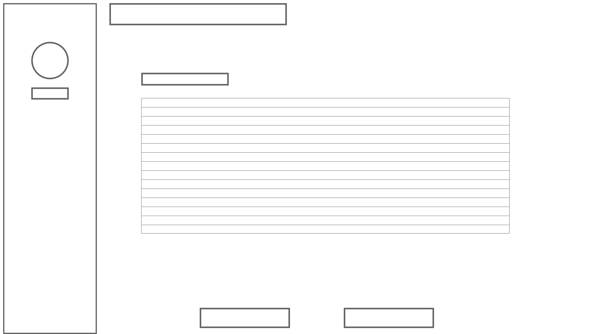

<h1> </h1>

<h1> </h1>

# IPT B4 Assignment

### By Thomas Fraser | 12 Hamilton

### Stages 1-3

<P hidden>Page Break to end the page :thumbsup:</P>

<P style="page-break-before: always"></P>

<h1> </h1>

## Stage 1 - Identification

#### Preamble

Classroom allocation can often be a difficult and messy process for both teachers and students of an educational institute such as Brisbane Boys' College. As the current system stands, there is a break in communication between teachers and students in this regard. Often room changes are never communicated to students leading to wasting time with students scrambling to find their new classroom.

#### Solution

The solution to the identified problem is to conceive, design and build a web based application using Python and Flask that allows teachers to create, modify and alert students to room changes. The solution must be capable of allowing teachers to request room changes, confirm room changes while giving a reason and to notify students via either email or integration with schoolbox, the primary web tool used at the school. Teachers should have the ability to, through a web based interface written in HTML, CSS and DJANGO (implemented from Flask), view the class allocated to a classroom in a period and request a room change. The teacher would enter the start time and end time that the class is required, the class to ocupy the room change and any notes such as a reason for the change. This information will then be send (via email) to the staff member/s ocupying the requested classroom asking for a room change. The staff memeber will then be offered a change to accept change. If the change is accepted, the teacher will be found a new classroom automatically by the system to move to. Once this process is completed, both teachers will be emailed a confirmation of the switch and the students of both classes will be either emailed or notified via schoolbox about the changes and the reason.

## Stage 2 - Conceptualisation 

The goal of the project is to make a useful application that can be used by the staff or students of Brisbane Boys' College to make menial day to day tasks much easier to complete. The success of the system will be determined by the ease of use and overall acceptance of the system into the current system at BBC. The project can be deemed a success if it is widely accepted at the college as the most functional and easy to use system for organising classroom changes. The end user of the project should be able to easily organise and communicate room changes with other staff and students, receiving the burden of organising room changes with lengthy email chains. The system will contain data relating to rooms, classes, teachers and students. This information will be organised into a database and related to each other. 

<P hidden>Page Break to end the page :thumbsup:</P>

<P style="page-break-before: always"></P>

<h1> </h1>

###### Data Table Example

PK = Primary Key, FK = Foreign Key

| STUDENT        | COURSE         | TEACHER        | ROOM        | ROOMCHANGE     |
| -------------- | -------------- | -------------- | ----------- | -------------- |
| StudentID (PK) | CourseID (PK)  | TeacherID (PK) | RoomID (PK) | RequestID (PK) |
| Name           | Name           | Name           | Block       | Course1ID (FK) |
| Email          | RoomID (FK)    | Email          | Subject     | Course2 (FK)   |
| CourseID (FK)  | TeacherID (FK) |                |             |                |
|                | Old_room       |                |             |                |
|                | New_Room       |                |             |                |

The staff members will interact with the database using a Graphical User Interface (GUI) based in a web application written in HTML, CSS, PYTHON and using FLASK. The user interface will allow teachers to communicate with the database in a simple and informative fashion. The user interface should be designed so that no to little instruction or training should be provided to the teachers prior to the introduction of the project into the system.

###### WireFrame UI Example



<h1> </h1>

## Stage 3 - Formalisation		 

###### Elementary Facts

**STUDENT** has StudentID (number)

**STUDENT** has Name (text)

**STUDENT** has Email (text)

**STUDENT** has CourseID (number)

<h1></h1>

**COURSE** has CourseID (number)

**COURSE** has Name (text)

**COURSE** has RoomID (number)

**COURSE** has TeacherID (text)

**COURSE** has Old_Room (number)

**COURSE** has New_Room (number)

<h1></h1>

**TEACHER** has TeacherID (number)

**TEACHER** has Name (text)

**TEACHER** has Email (text)

<h1></h1>

**ROOM** has RoomID (number)

**ROOM** has Block (text)

**ROOM** has Subject (text)

<h1></h1>

**ROOMCHANGE** RequestID (number)

**ROOMCHANGE** Course1ID (number)

**ROOMCHANGE** Course2ID (number)

###### Elementary Facts (SQL)

```sql
STUDENT(StudentID INT, Name TEXT, Email TEXT, CourseID INT);
COURSE(CourseID INT, Name TEXT, RoomID INT, TeacherID INT, Old_Room INT, New_Room INT);
TEACHER(TeacherID INT, Name TEXT, Email, TEXT);
ROOM(RoomID INT, Block TEXT, Subject TEXT);
ROOMCHANGE(RequestID INT, Course1ID INT, Course2ID INT);
```

