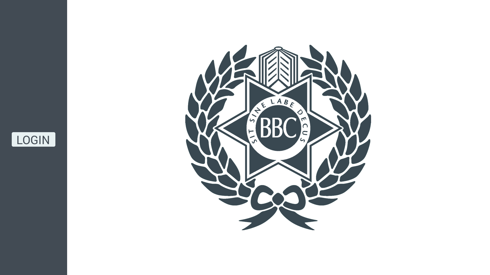
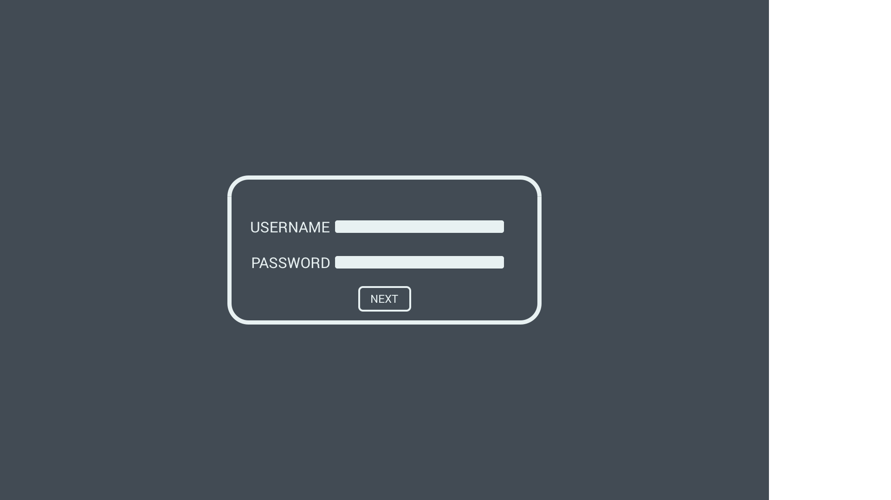
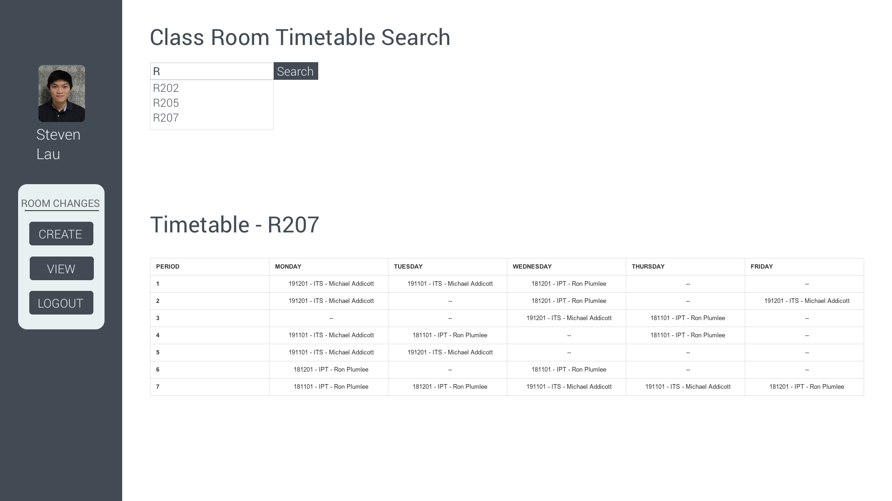
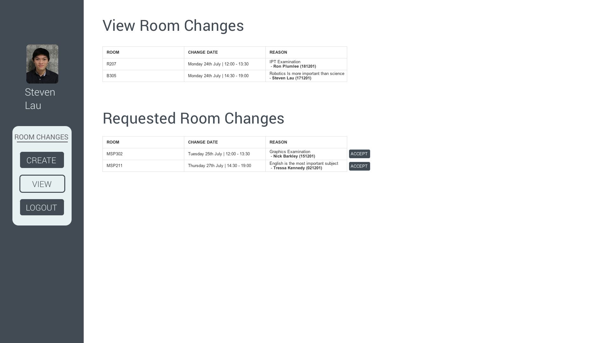

<h1> </h1>

<h1> </h1>

# IPT B4 Assignment

### Thomas Fraser | 12 Hamilton

### Stages 1-3

Page Break to end the page :thumbsup:

### Table of Contents

[TOC]

Page Break to end the page :thumbsup:

## Stage 1 - Identification

#### Preamble

All too often do room changes at schools cause confusion and cause a waste of time for both staff and students. As the current system stands, there is no clear communication between students and staff relating room changes. Room changes are often never communicated to students. This project to be introduced aims to solve this problem with automation of the room change system and database controlled information.

#### Solution

The aforementioned project provides a solution to the problem of classroom scheduling. The solution to the problem is to conceive, design and build a web based application using Python and Flask that will allow teachers to create, modify and notify students to room changes. The solution must be capable of allowing teachers to request room changes, confirm room changes while giving a reason and to notify students via either email or integration with school box, the primary web tool used at the school. Teachers should have the ability to, via a web interface, view the class allocated to a classroom in a period and request a change. The system should be intuitive and the staff should have to enter minimal details. Some details required would be the time frame that the classroom is needed for, the date and a reason for the change. This information would then be sent via email to the staff member occupying the requested classroom. The staff member will then be offered a chance to accept the change. If the change is accepted, the teacher will be found a new free classroom automatically by the system. Once this process is completed, both teacher will be emailed a confirmation of the switch and the students of both classes will either be emailed or notified via school box about the changes.

## Stage 2 - Conceptualisation 

The goal of the project is to make a useful application that can be used by the staff and students of Brisbane Boys' College to make menial day to day tasks much easier and intuitive to complete. The success of the system will be determined by two factors; the ease of use of the system and overall acceptance of the system by staff. The project can be deemed a success if it is widely accepted at the college as the most functional system for organising room changes. The end user of the project should be able to easily organise room changes without lengthy email chains and an outdated system. The system will contain data relating to rooms, classes, teachers, students and subjects. The information will be organised into tables in a database and related to each other using primary and foreign keys.

Page Break to end the page :thumbsup:

###### Data Table Example

| STUDENT       | Subject   | TEACHER       | ROOM    | ROOMCHANGE | STUDENT-SUBJECT  |
| ------------- | --------- | ------------- | ------- | ---------- | ---------------- |
| StudentID     | SubjectID | TeacherID     | RoomID  | RequestID  | StudentSubjectID |
| Student Name  | Name      | Teacher Name  | Block   | Course1ID  |                  |
| Student Email | RoomID    | Teacher Email | Subject | Course2    |                  |
| SubjectID     | TeacherID |               |         |            |                  |
|               | Old_room  |               |         |            |                  |
|               | New_Room  |               |         |            |                  |

The staff members will interact with the database using a Graphical User Interface (GUI) based in a web browser that will be written using web technologies such as HTML and CSS for the front end with a robust PYTHON and FLASK backend. The user interface will allow teachers to access with the database in a simple, intuitive and informative fashion. The user interface should be designed so that little to no instruction or training should be provided to the teachers prior to the introduction of the project into the school ecosystem.

###### WireFrame UI Example

Page Break to end the page :thumbsup:

###### Example Data Table

| STUDENT TABLE | Data                 |
| ------------- | -------------------- |
| StudentID     | 18135                |
| Student Name  | Thomas Fraser        |
| Student Email | 18135@bbc.qld.edu.au |
| Subject ID    | 181201               |

| SUBJET TABLE | Data   |
| ------------ | ------ |
| 1SubjectID   | 181201 |
| Name         | IPT    |
| RoomID       | R207   |
| TeacherID    | 1415   |
| Old_room     | R207   |
| New_room     | R205   |

| TEACHER TABLE | Data                    |
| ------------- | ----------------------- |
| TeacherID     | 1415                    |
| Teacher Name  | Ron Plumlee             |
| Teacher Email | rplumlee@bbc.qld.edu.au |
|               |                         |

| ROOM TABLE | Data       |
| ---------- | ---------- |
| RoomID     | R207       |
| Block      | Rudd Block |
| Subject    | IPT        |

| ROOMCHANGE TABLE | Data |
| ---------------- | ---- |
| RequestID        | 2038 |
| Course1ID        | IPT  |
| Course2ID        | ITS  |
|                  | Data |

| STUDENT-SUBJECT TABLE | Data |
| --------------------- | ---- |
| StudentSubjectID      | 6574 |
|                       |      |

## Stage 3 - Formalisation		 

The following elementary facts, data dictionaries, CSDs, RSDs and UI/form design were designed using the Data Table example found in stage two along with the example data. The elementary facts define what each table will contain, including examples for each row. The data dictionary table takes the definitions from the Elementary Facts and further defines them in terms of SQL by using the correct SQLITE3 data types and constraints. The data dictionary also contains a small description of what each row contains. The CSDs were designed following the design criteria provided and learnt from the 'Designing Databases' book. The optimal normal form diagram expands on the CSD and describes the different tables on the CSD. The relational schema diagram relates the seperate tables to each other. The diagram explains how the tables interact using primary and foreign keys. Finally the UI / form examples give a rough estimation of how the end user will interact with the database via a web application. The UI examples display all the important pages that the website will consist of including the landing page, login page and logged in landing page.

###### Elementary Facts

**STUDENT** has StudentID (Number) '18135'

**STUDENT** '18135' has Name (Name) '*Thomas* *Fraser*'

**STUDENT** '18135' has Email (Email) '*18135@bbc.qld.edu.au*'

**STUDENT** '18135' has CourseID (Number) '*IPT_4*'

<h1></h1>

**SUBJECT** has SubjectID (Number) '181201'

**SUBJECT** '181201' has Name (Name) '*IPT*' 

**SUBJECT** '181201' has RoomID (Number) '*R207*'

**SUBJECT** '181201' has TeacherID (Number) '*1451*' 

**SUBJECT** '181201' has Old_Room (Number) '*R207*' 

**SUBJECT** ' 181201' has New_Room (Number) '*R205*' 

<h1></h1>

**TEACHER** has TeacherID (Number) '1415'

**TEACHER** '1451' has Name (Name) '*Ron* *Plumlee*' 

**TEACHER** '1415' has Email (Email) '*rplumlee@bbc.qld.edu.au*' 

<h1></h1>

**ROOM** has RoomID (Number) 'R207'

**ROOM** 'R207' has Block (Name) '*Rudd Block*' 

**ROOM** 'R206' has Subject (Name) '*IT*'

<h1></h1> 

**ROOMCHANGE** has RoomChangeID (Number) '2038'

**ROOMCHANGE** '2038' Course1ID (Name) '*IPT*' 

**ROOMCHANGE** '2038' Course2ID (Name) '*ITS*'

###### Data Dictionary

| Field Name        | Data Type | Constraint  | Description                              |
| ----------------- | --------- | ----------- | ---------------------------------------- |
| **STUDENT TABLE** |           |             |                                          |
| StudentID         | INT       | Primary Key | Student Identifier                       |
| Student Name      | TEXT      | Not null    | Name of the student                      |
| Student Email     | TEXT      | Not null    | Email of the student                     |
| **SUBJECT TABLE** |           |             |                                          |
| SubjectID         | INT       | Primary Key | Subject Identifier                       |
| Name              | TEXT      | Not null    | Name of the subject                      |
| RoomID            | INT       | Foreign Key | Room that the class is normally in       |
| TeacherID         | INT       | Foreign Key | Identifier for the teacher taking the class |
| Old_Room          | INT       | Not null    | Old room for the subject                 |
| New_Room          | INT       | Not null    | New room for the subject                 |
| **TEACHER TABLE** |           |             |                                          |
| TeacherID         | INT       | Primary Key | Teacher Identifier                       |
| Teacher Name      | TEXT      | Not null    | Name of the teacher                      |
| Teacher Email     | TEXT      | Not null    | Email of the email                       |
| **ROOM TABLE**    |           |             |                                          |
| RoomID            | INT       | Primary Key | Identifier of the room                   |
| Block             | TEXT      | Not null    | Building that the class room is in       |
| Subject           | TEXT      | Not null    | The primary subject for the room         |
| **REQUEST TABLE** |           |             |                                          |
| RequestID         | INT       | Primary Key | The room change request Identifier       |
| Course1ID         | INT       | Not null    | STUDENT-SUBJECT table relating to course 1 |
| Course2ID         | INT       | Not null    | STUDENT-SUBJECT table relating to course 2 |
| **SS TABLE**      |           |             |                                          |
| StudentSubjectID  | INT       | Primary Key | The ID for the combination table of student and subject |
|                   |           |             |                                          |

Page Break to end the page :thumbsup:

###### Conceptual Schema Diagram (CSD)

Page Break to end the page :thumbsup:

###### Optimal Normal Form CSD

Page Break to end the page :thumbsup:

###### Relational Schema Diagram

Page Break to end the page :thumbsup:

###### UI and Form Design

Landing Page

The landing page is where the end user will enter when they direct to the web address of the web 						application. The user interface contains a sidebar with an imbedded login button and A BBC Logo. When the login button is pressed, the sidebar animates to the right and the BBC Logo slides off screen. The screen animates to the Login Page.

Login Page (Animated from Landing Page)

The login page is animated from the landing page. The login page allows the user the enter a username and password to login to the class room changing system. The username and password will be the same as the ones used by the schools IT system. Therefore, this part of the database will interface with the school IT system and therefore no login information needs to be stored in the database.

Class Search Page (Landing page after login)

Once a user is logged in they are faced with a class search page, which is the landing page from login. The sidebar returns to it original width from the landing page and user details such as an image and name are displayed. The main selectors for interaction with the website are also located in the sidebar. The primary options are 'CREATE', 'VIEW' and 'LOGOUT'. The 'CREATE' button is used to create a room change by interactively clicking on the Rooms timetable as displayed below. The 'VIEW' button redirects to the page displayed below. The 'LOGOUT' button logs the user out of the service.

View Page (After pressing view on Class Search Page)

The view page contains two tables and a sidebar. The tables include room changes that the teacher is part of and room change request made to the teachers classes. The sidebar has the 'VIEW' tab highlighted as it is the current selected option. The 'Requested Room Changes' table have options for the teacher to accept a room change.

