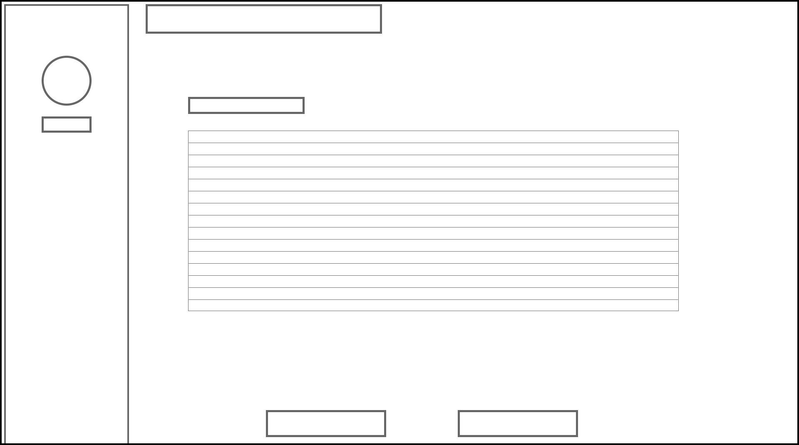

<h1> </h1>

<h1> </h1>

# IPT B4 Assignment

### By Thomas Fraser | 12 Hamilton

### Stages 1-3

<P hidden>Page Break to end the page :thumbsup:</P>

<P style="page-break-before: always"></P>

## Stage 1 - Identification

Stage 1 - Identification

#### Preamble

All too often do room changes at schools cause confusion and cause a waste of time for both staff and students. AS the current system stands, there is no clear communication between students and staff relating room changes. Room changes are often never communicated to students. This project to be introduced aims to solve this problem with automation and database controlled information.

#### Solution

The aforementioned project provides a solution to the problem of classroom scheduling. The solution to the problem is to conceive, design and build a web based application using Python and Flask that will allow teachers to create, modify and notify students to room changes. The solution must be capable of allowing teachers to request room changes, confirm room changes wile giving a reason and to notify students via either email or integration with school box, the primary web tool used at the school. Teachers should have the ability to, via a web interface, view the class allocated to a classroom in a period and request a change. The system should be intuitive and the staff should have to enter minimal details. Some details required would be the time frame that the classroom is required for, the date and a reason for the change. This information would then be sent via email to the staff member occupying the requested classroom. The staff member will then be offered a chance to accept the change. If the change is accepted, the teacher will be found a new free classroom automatically by the system. Once this process is completed, both teacher will be emailed a confirmation of the switch and the students of both classes will either be emailed or notified via school box about the changes.

## Stage 2 - Conceptualisation 

The goal of the project is to make a useful application that can be used by the staff and students of Brisbane Boys' College to make menial day to day tasks much easier and intuitive to complete. The success of the system will be determined by two factors. The ease of use of the system and overall acceptance of the system by staff. The project can be deemed a success if it is widely accepted at the college as the most functional system for organising room changes. The end user of the project should be able to easily organise room changes without length email chains or little communication. The system will contain data relating to rooms, classes, teachers, students and subjects. The information will be organised into tables in a database and related to each other using primary and foreign keys.

<P hidden>Page Break to end the page :thumbsup:</P>

<P style="page-break-before: always"></P>

###### Data Table Example

PK = Primary Key, FK = Foreign Key

| STUDENT        | COURSE         | TEACHER        | ROOM        | ROOMCHANGE     |
| -------------- | -------------- | -------------- | ----------- | -------------- |
| StudentID (PK) | CourseID (PK)  | TeacherID (PK) | RoomID (PK) | RequestID (PK) |
| Name           | Name           | Name           | Block       | Course1ID (FK) |
| Email          | RoomID (FK)    | Email          | Subject     | Course2 (FK)   |
| CourseID (FK)  | TeacherID (FK) |                |             |                |
|                | Old_room       |                |             |                |
|                | New_Room       |                |             |                |

The staff members will interact with the database using a Graphical User Interface (GUI) based in a web browser that will be written in HTML and CSS for the front end with a robust PYTHON and FLASK backend. The user interface will allow teachers to access with the database in a simple and informative fashion. The user interface should be designed so that no to little instruction or training should be provided to the teachers prior to the introduction of the project into the system.

###### WireFrame UI Example



## Stage 3 - Formalisation		 

==//I Should have some writing here==

###### Elementary Facts

**STUDENT** has StudentID

**STUDENT** has Name

**STUDENT** has Email 

**STUDENT** has CourseID 

<h1></h1>

**COURSE** has CourseID 

**COURSE** has Name 

**COURSE** has RoomID 

**COURSE** has TeacherID 

**COURSE** has Old_Room 

**COURSE** has New_Room 

<h1></h1>

**TEACHER** has TeacherID 

**TEACHER** has Name 

**TEACHER** has Email 

<h1></h1>

**ROOM** has RoomID 

**ROOM** has Block 

**ROOM** has Subject 

<h1></h1>

**ROOMCHANGE** RequestID 

**ROOMCHANGE** Course1ID 

**ROOMCHANGE** Course2ID 

###### Elementary Facts (SQL)

```sql
STUDENT(StudentID INT, Name TEXT, Email TEXT, CourseID INT);
COURSE(CourseID INT, Name TEXT, RoomID INT, TeacherID INT, Old_Room INT, New_Room INT);
TEACHER(TeacherID INT, Name TEXT, Email, TEXT);
ROOM(RoomID INT, Block TEXT, Subject TEXT);
ROOMCHANGE(RequestID INT, Course1ID INT, Course2ID INT);
```

###### Conceptual Schema Diagram (CSD)


<P hidden>Page Break to end the page :thumbsup:</P>

<P style="page-break-before: always"></P>

###### Optimal Normal Form CSD


<P hidden>Page Break to end the page :thumbsup:</P>

<P style="page-break-before: always"></P>

###### Relational Schema Diagram


###### UI Design


